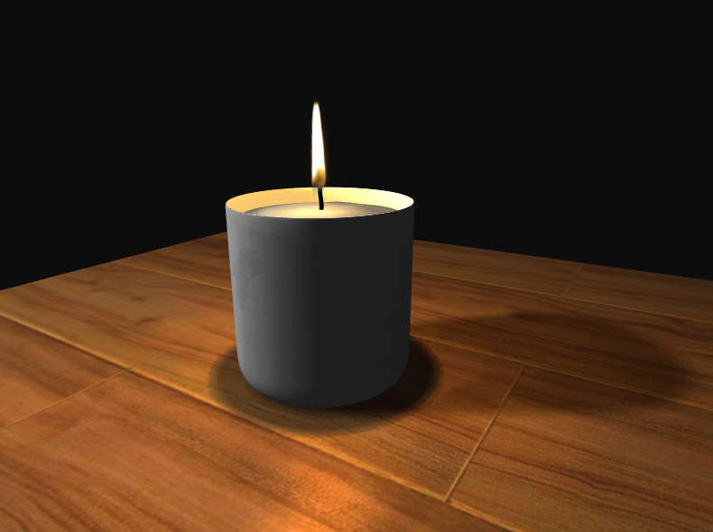
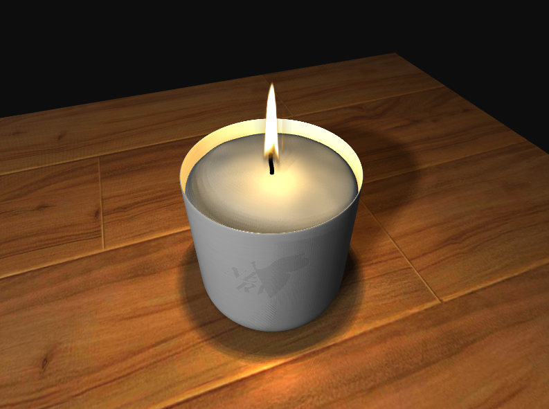
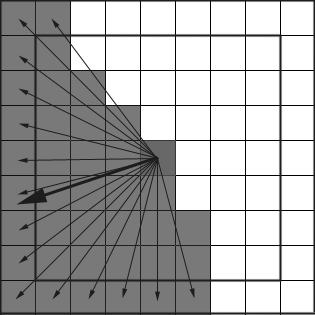
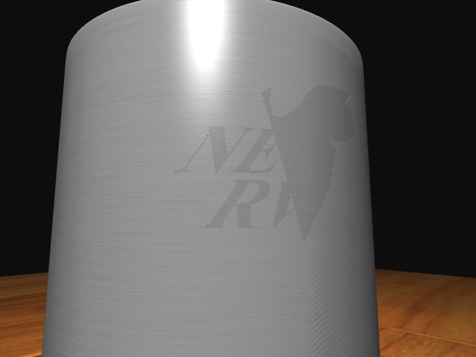
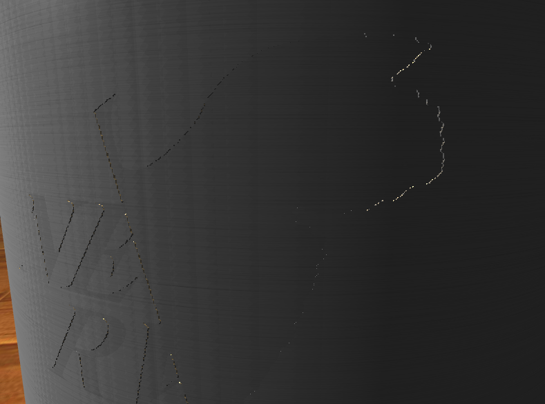
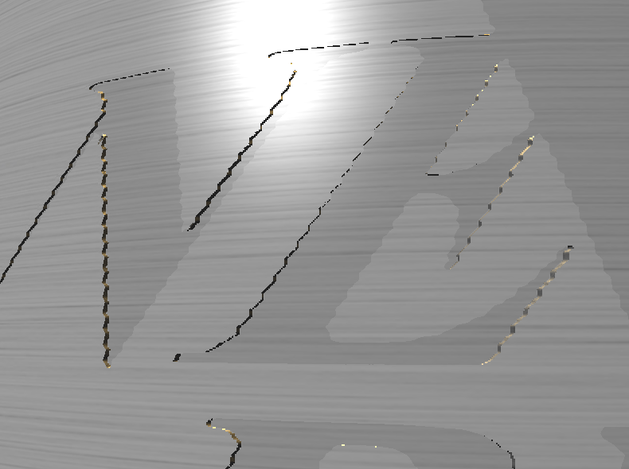
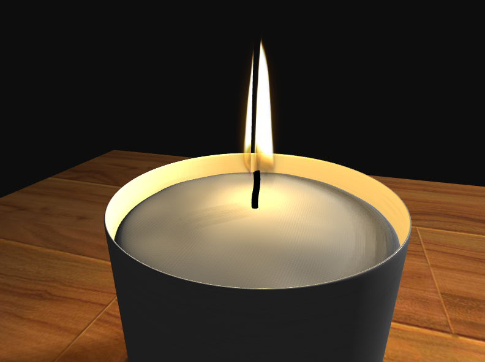

Candle Flame
===============

Description
------------------

I loaded [a candle model](https://www.cgtrader.com/3d-models/furniture/other/tom-dixon-eclectic-scented-candles) using assimp and implemented the following features:

- Shadow

 Depth cubemap is used and the shadows are averaged on 20 samples to look more soft and smooth.

 

 

- Parallax Mapping

  The model doesn't provide normal texture. To make the parallax mapping result looks better, I estimate the normals in the following way.

  Suppose we want to estimate the normal at the center pixel of the texture below. I select pixels whose distance to the center is in a certain range (e.g. \[4,4\] in the graph below). Then normalize the vectors fron the center to these pixels who are black (thin arrows) and take average (bold arrow). Finally normalizing the average we get our estimated normal vector.

  <div style="text-align:center"></div>

  This a stable estimation and the result looks nice:

  

  

  


A Problem
-------------

The flame is rendered as two perpendicular 2D texture with transparency.

<div style="text-align:center"></div>

This may incur problems when the front object is rendered first and the depth test discards objects behinds, even if the front one has transparency. It looks like



Unfortunately, since the two flame planes intersect with each other, we cannot simply render the objects in descent order of distance to the camera to avoid this problem. In this scenario, we need more advanced techniques like order independent transparency, which I don't know yet.

Useage
--------------------

0. Download the source code:
   ```
   git clone https://github.com/nyu-cg-spring-18/final-project-yixiangLuo.git
   ```

1. Create a directory called `build` in the main directory, e.g.:
   ```
   mkdir build
   ```
2. Use CMake to generate the Makefile/project files needed for compilation inside the `build/` directory:
   ```
   cd build; cmake -DCMAKE_BUILD_TYPE=Release ..
   ```
3. Compile and run the compiled executable by typing:
   ```
   make; ./final_project
   ```

In the program,

- use `W` `A` `S` `D` to move the camera;

- press `M` to toggle the "look around mode" in which you can move mouse to change the view direction;

- press `P` to toggle the "light running mode" in which the auxiliary light will move as time goes by.
